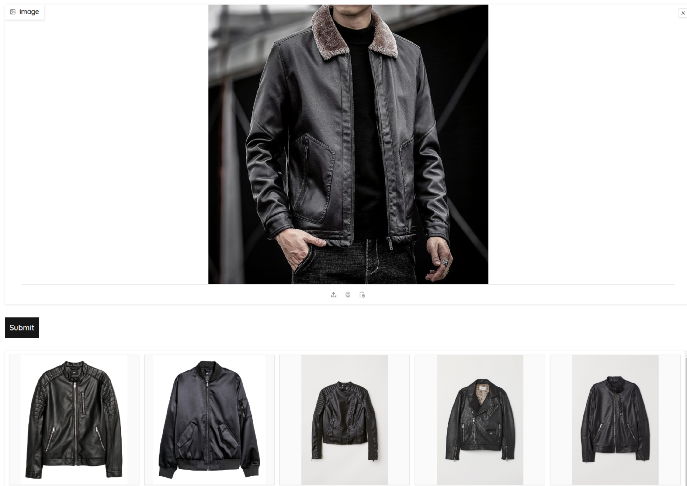

## Visual Search

This project uses the H&M fashion dataset available on Kaggle the library `faiss` to create a basic image vision search using ViT model from sentence transformers.

  
  <h6 align="center">
    Here is an example
  </h6>

## Requirements

- Python 3.10 or later
- Click
- Faiss
- Sentence Transformers